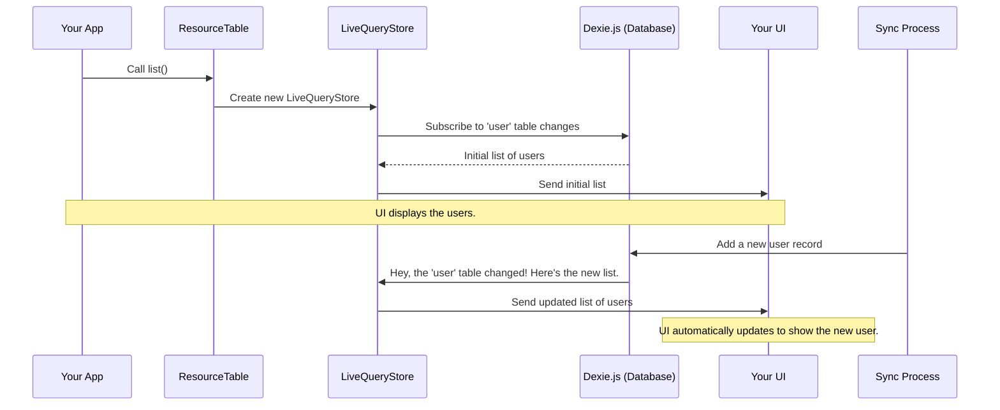

# Chapter 8: Data Persistence: Resources and the Database

In the [previous chapter on Data Synchronization](data-synchronization-1567356394.md), we learned how `hawki-client` automatically keeps your application's data up-to-date. We mentioned that the client saves all this synced data to a "local database." But what exactly is this database, and how does it work?

This chapter will pull back the curtain on data persistence. We'll explore how `hawki-client` stores information right inside your browser, making your app fast, responsive, and even capable of working offline.

### The Problem: A Fast and Resilient App

Imagine you're building a chat application. When a user opens the app, they expect to see their old conversations immediately, even before the internet connection is fully established. If they go into a tunnel and lose their signal, they should still be able to read past messages.

To make this happen, the application can't rely on fetching everything from the server every single time. It needs a local cache, a personal filing cabinet stored on the user's device. This is where `hawki-client`'s persistence layer comes in.

### The Solution: A Local Database in Your Browser

`hawki-client` leverages a powerful browser feature called **`IndexedDB`** to create a private, local database for your application. Think of it as a small, super-fast database that lives on the user's computer, managed entirely by the client.

To make working with this database easy, `hawki-client` uses a popular library called **`Dexie.js`**. You won't have to interact with `Dexie.js` directly, but it's the engine running under the hood.

This local database is the destination for all the data brought in by the [Data Synchronization](data-synchronization-1567356394.md) process. Messages, user profiles, room details—it's all stored here for instant access.

### Resources: The Blueprints for Your Data

Before we can store anything, we need to tell the database *what* we're storing. In `hawki-client`, these data blueprints are called **Resources**. A resource is simply a definition for a type of data, like a `user`, a `room`, or a `message`.

These resources are defined internally using a helper function called `defineResource`. This function allows the library developer to specify important details, like which fields should be searchable (which we call "indexes").

For example, the internal definition for a `user` resource might look something like this:

```javascript
// A simplified internal definition for the 'user' resource
const userResource = defineResource</*...*/>()({
  // This tells the database to create a searchable index
  // for the 'displayName' and 'status' fields.
  indexedKeys: ['displayName', 'status'],
});
```

Here, we're telling the database: "We're going to store 'user' objects. Please make it extra fast to look up users by their `displayName` or `status`."

### The `ResourceDb` and its `ResourceTable`s

So, the data is synced and stored in a local database according to resource blueprints. How do you, the developer, actually get this data?

Your main entry point to the database is `client.resourceDb`. This object is the master key to the entire local data store. However, you rarely use `resourceDb` directly. Instead, you ask it for a specific "table" of data.

A `ResourceTable` is an object that lets you interact with all the records of a single resource type. You get it by calling `client.resourceDb.getTable()`.

```javascript
// Get the table that manages all 'user' records
const userTable = client.resourceDb.getTable('user');

// Get the table that manages all 'room' records
const roomTable = client.resourceDb.getTable('room');
```

Think of `resourceDb` as the whole filing cabinet, and `getTable('user')` as pulling open the "Users" drawer. Now you're ready to find the files inside.

### The Magic Connection: Reactive Tables

This is where everything comes together. When you use a `ResourceTable` to ask for data, it doesn't just give you a static, one-time list. It gives you a **`ReactiveStoreFront`**—the same reactive store we mastered in [Chapter 3: Reactive State Management with Stores](reactive-state-management-with-stores-1007900773.md)!

Let's see this in action. The `userTable` has two primary methods: `list()` and `one()`.

#### Getting a List of Records

The `list()` method returns a reactive store containing an array of all records in that table.

```javascript
const userTable = client.resourceDb.getTable('user');
const allUsersStore = userTable.list();

allUsersStore.subscribe(users => {
  console.log(`There are now ${users.length} users in the local DB.`);
  // Your UI can now render this list.
});
```

Now, `allUsersStore` is a live view into the `user` table. If the sync process adds a new user, the `allUsersStore` will automatically update, your subscription will fire, and your UI will magically show the new user.

#### Getting a Single Record

The `one()` method is similar, but it fetches a single record by its ID.

```javascript
const userTable = client.resourceDb.getTable('user');
const aliceStore = userTable.one(123); // Get the user with id 123

aliceStore.subscribe(user => {
  if (user) {
    console.log(`User 123's name is: ${user.displayName}`);
  }
});
```

If user 123's `displayName` is ever updated by the sync process, this subscription will run again with the new data. This seamlessly bridges the gap between the persistent database and your live user interface.

### What Happens Under the Hood?

When you call `userTable.list()`, how does it create a store that's magically linked to the database? It uses a special kind of store called a `LiveQueryStore`.

Let's trace the journey.



This "live query" capability is a core feature of `Dexie.js`, and `hawki-client` wraps it in the familiar `ReactiveStoreFront` interface.

Let's look at the relevant code pieces.

1.  **Defining the Database Structure**

    The `createResourceDb` function in `src/internal/resources/db/ResourceDb.ts` is responsible for setting everything up. It reads all the `Resource` definitions (like the one for `user`) and tells `Dexie.js` what tables and indexes to create.

    ```typescript
    // A simplified view from src/internal/resources/db/ResourceDb.ts
    function createTableSchemas(resources: Record<ResourceName, any>) {
      const schemas: TableSchema[] = [];
      for (const [name, definition] of Object.entries(resources)) {
        // Reads the 'indexedKeys' from the resource definition
        const indexString = (definition.indexedKeys || []).join(', ');
        schemas.push({ name, indexString: 'id, ' + indexString });
      }
      return schemas;
    }
    ```
    This function generates the schema that `Dexie.js` needs to build the database correctly.

2.  **Creating the Reactive Tables**

    Inside `src/internal/resources/db/ResourceTable.ts`, the `createResourceTable` function builds the `list()` and `one()` methods. You can see it explicitly uses `createLiveQueryStore`.

    ```typescript
    // A simplified view from src/internal/resources/db/ResourceTable.ts
    export function createResourceTable(/*...*/) {
      const list = createStoreFrontProvider(
        () => createLiveQueryStore(
          // This function tells Dexie to get all records
          () => table.toArray() 
        )
      );

      const one = createStoreFrontProvider(
        (id) => createLiveQueryStore(
          // This function tells Dexie to get one record by its id
          () => table.get(id)
        )
      );

      return { list, one, /*...*/ };
    }
    ```
    This code elegantly shows the link: calling `list()` creates a `LiveQueryStore` that is configured to run `table.toArray()` whenever the underlying `Dexie` table changes. This is the heart of the reactive persistence layer.

### Conclusion

You've now demystified the persistence layer of `hawki-client` and seen how it provides a fast, reactive, and offline-ready foundation for your application.

You have learned that:
*   `hawki-client` uses `IndexedDB` and `Dexie.js` to store data locally in the browser.
*   Data models are defined as **Resources**, which specify how data is stored and indexed.
*   You access stored data through `client.resourceDb.getTable('resourceName')`, which gives you a `ResourceTable`.
*   The table methods `list()` and `one()` return reactive stores, creating a live link between your database and your UI.
*   This architecture makes your application feel incredibly fast and responsive by default.

We've seen how data is defined, synced, and stored. But how does data, especially large files, get from your device to the server in the first place? The next chapter will explore the network layer that handles all of `hawki-client`'s communication.

Next: [Network and File Transfers](network-and-file-transfers-715941119.md)

