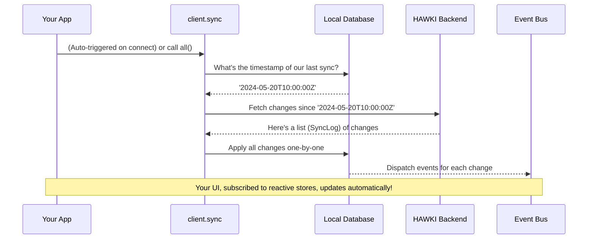

# Chapter 7: Data Synchronization

In the [previous chapter on End-to-End Encryption and The Keychain](end-to-end-encryption-and-the-keychain-1491275150.md), we saw how `hawki-client` keeps your conversations private and secure. Now, let's address another critical question: if you use your app on your phone and then open it on your laptop, how does the laptop know about all the new messages you sent? How does everything stay perfectly in sync?

This chapter introduces the silent, hardworking engine that makes this possible: the `SyncFeature`, accessible via `client.sync`. It's responsible for making sure your local copy of the data is always a perfect mirror of what's on the server.

### The Problem: The Ever-Changing Shared World

Imagine you and your friends are working on a massive jigsaw puzzle. If you're all in the same room, you can see when someone places a new piece. But what if you leave for a few hours? When you come back, the puzzle has changed. You need to quickly see all the new pieces that were added while you were gone. And once you're caught up, you want to see, in real-time, whenever someone else adds a new piece.

This is the exact problem `hawki-client` solves. Your app's data—rooms, messages, user profiles—is a shared world. The `SyncFeature` is the mechanism that:
1.  **Catches you up** on all the changes that happened while you were offline.
2.  **Shows you live updates** as they happen while you're connected.

### Data Syncing: Mostly a Spectator Sport

Here's the best part: for the most part, you don't have to do anything. The `SyncFeature` is designed to be almost entirely automatic.

When your client first connects, it automatically performs an **initial sync**. It asks the server, "What's changed since the last time I was here?" The server sends back a list of all the new or updated data, which your client then saves to its local database.

After that, the client opens a real-time websocket connection and listens for `SyncLogEvent` messages. Every time something changes on the server (like a new message arriving), the server broadcasts an event, and your client applies that small, incremental update immediately.

This means your [reactive stores](reactive-state-management-with-stores-1007900773.md) just update themselves, and your UI stays fresh without you writing any complex logic.

### The "Refresh" Button: Manual Synchronization

While the automatic sync handles 99% of cases, there might be situations where you want to trigger a sync manually. For example, if a user's device has been offline for a very long time, you might want to provide a "Refresh" button to give them peace of mind that all data is being fetched.

For this, you can use the `client.sync.all()` method.

```javascript
// A simple "Refresh Data" button handler
async function handleRefreshClick() {
  console.log('Starting a manual data sync...');
  try {
    await client.sync.all();
    console.log('Sync complete! All data is fresh.');
  } catch (error) {
    console.error('Manual sync failed:', error);
  }
}
```
When you call `client.sync.all()`, the client will repeat its initial sync process: it will check the timestamp of its last update and ask the server for everything that has changed since then.

You generally **do not** need to call this on every app startup. The automatic sync already takes care of that. This function is for special cases where you want to explicitly re-trigger the "catch-up" process.

### What Happens Under the Hood?

The sync process is a beautifully coordinated two-act play: the initial catch-up, and the real-time updates that follow.

Let's visualize the initial sync flow.



Let's see where this logic lives in the code.

#### 1. Automatic Startup

The magic of the automatic sync begins in `src/internal/resources/sync/SyncFeature.ts`. When the feature is initialized, it registers a listener on the `onInit` event. This means as soon as the client is ready, the `startSync()` function is called.

```typescript
// A simplified view from src/internal/resources/sync/SyncFeature.ts
export const SyncFeature = defineFeature(
  (connection, {autoSync}) => {
    // ... setup ...

    // This is the function that performs the catch-up sync
    const startSync = async (): Promise<void> => {
      const lastTimestamp = await lastSync.get(); // Get timestamp from local DB
      return sync.run(undefined, lastTimestamp);   // Run the sync process
    };

    // If autoSync isn't disabled, hook into the client's startup process
    if (autoSync !== false) {
      eventBus.onInit(() => startSync(), eventBus.LOWEST_PRIORITY);
    }
    
    // ...
  }
);
```
This is how `hawki-client` fires up the sync process automatically. The `autoSync` option, which defaults to `true`, can be configured during client creation, as we learned in [Chapter 1: HawkiClient: Creation and Configuration](hawkiclient-creation-and-configuration-382472665.md).

#### 2. Fetching in Chunks

Making a single giant request for a year's worth of data would be slow and inefficient. Instead, `hawki-client` is smart about it. It fetches the `SyncLog` (the list of changes) in manageable pieces, or "chunks." This logic is handled by `fetchSyncLogChunked` in `src/internal/resources/sync/api.ts`.

```typescript
// A conceptual view of fetching in chunks
async function fetchInChunks(onChunkReceived) {
  let offset = 0;
  const chunkSize = 1000;

  while (true) {
    // Ask for a chunk of 1000 items starting at the current offset
    const chunk = await connection.transfer.requestJson('syncLog', {
      queryParams: { offset, limit: chunkSize, /*...*/ }
    });

    if (chunk.log.length === 0) break; // No more data

    await onChunkReceived(chunk); // Process the chunk

    offset += chunkSize; // Move to the next chunk
  }
}
```
This loop continues until all changes have been fetched, ensuring the client remains responsive even during a large sync.

#### 3. Listening for Live Updates

Once the initial sync is complete, the client switches to listening for real-time updates over websockets. Back in `SyncFeature.ts`, it sets up a listener for `SyncLogEvent` messages.

```typescript
// A simplified view from src/internal/resources/sync/SyncFeature.ts
const handleIncomingSyncLogEntry = async (message: SyncLogEntry) => {
  // Ignore events if a big global sync is already running
  if (sync.isGlobalSyncRunning()) {
    return;
  }
  
  // Apply the small, incremental update
  return dispatchSyncEvent(message);
};

// Listen for SyncLogEvent messages coming from the server
eventBus.onUserWebsocketMessage('SyncLogEvent', handleIncomingSyncLogEntry);
```

Whenever a `SyncLogEvent` arrives, this function applies the update to the local database. This in turn notifies all the reactive stores, and your UI updates instantly. The whole system works together as a cohesive unit, orchestrated by [The Event Bus: The Client's Nervous System](the-event-bus-the-client-s-nervous-system-8645510.md).

### Conclusion

You've now seen the powerful, automated system that keeps your application's data consistent and up-to-date.

You have learned that:
*   The `SyncFeature` (`client.sync`) is responsible for keeping the local database consistent with the server.
*   Synchronization is mostly automatic, running an **initial sync** on connection and then listening for **real-time updates**.
*   You can manually trigger a "catch-up" sync using `client.sync.all()`, which is useful for things like a "Refresh" button.
*   Under the hood, the client intelligently fetches historical data in chunks and then applies live updates as they arrive.

We've talked a lot about the client saving data to a "local database." What exactly is this database? How is data stored, and how can you interact with it directly? Our next chapter will demystify this crucial component.

Next: [Data Persistence: Resources and the Database](data-persistence-resources-and-the-database-983608291.md)

