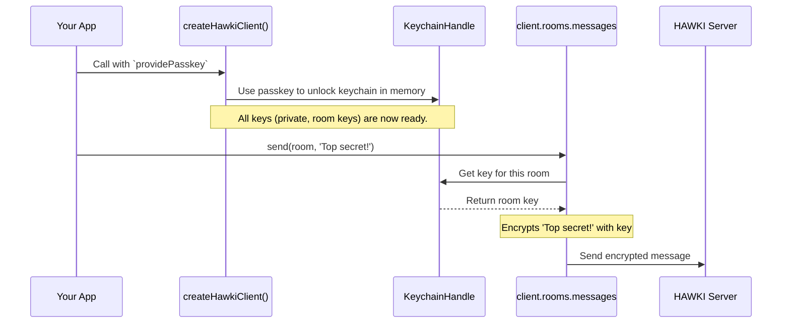

# Chapter 6: End-to-End Encryption and The Keychain

In the [previous chapter on Room Management](room-management-285498536.md), we learned how to send messages in a chat room. You might have wondered: if we're sending messages like `'Hello everyone!'`, who can read them? The answer is a core principle of HAWKI: **only the intended recipients can.**

This chapter dives into the security that makes this possible. We'll explore the concept of end-to-end encryption and meet the silent guardian that manages all our secrets: the `KeychainHandle`.

### The Problem: Sending a Secret Postcard

Imagine sending a message is like sending a postcard. Anyone who handles it—the mail sorter, the mail carrier, anyone at the server—can read what's written on it. This is not ideal for private conversations.

What if, instead, you put your message inside a locked box before mailing it? The mail carrier can still deliver the box, but they have no idea what's inside. Only the person who has the key to that specific box can open it and read the message.

This is the central idea behind **End-to-End Encryption (E2EE)**. Your message is "locked" (encrypted) on your device and only "unlocked" (decrypted) on the recipient's device. The HAWKI server acts as the mail carrier, moving the locked boxes around without ever being able to peek inside.

### The Keys to the Kingdom

To make this system work, we need a way to manage all these different keys. `hawki-client` uses two main types of keys:

1.  **Asymmetric Keys (A Mailbox):** Each user has a `public key` and a `private key`.
    *   Think of the **public key** as your home mailbox slot. Anyone can use it to drop a letter in for you.
    *   Think of the **private key** as the only key that can open your mailbox. You keep it safe and never share it.
    This pair is perfect for securely sharing secrets with one person, like when inviting them to a room and giving them the room's key.

2.  **Symmetric Keys (A Shared Room Key):** Each chat room has its own `room key`.
    *   Think of this as a single key that every member of the "clubhouse" (the room) gets a copy of.
    *   Everyone uses the same key to lock and unlock messages sent within that room. This is much more efficient for group conversations.

So, who keeps track of your personal private key and all the different room keys you've collected? This is where the keychain comes in.

### The Keychain: Your Digital Keyring

The `KeychainHandle` is an internal component of `hawki-client` that acts as your personal, highly secure digital keyring. It's a special, encrypted file stored on your device that holds:

*   Your personal `private key`.
*   A copy of every `room key` for every room you are a member of.

This entire keychain file is itself encrypted. It's a lockbox full of other keys. So how do you open this main lockbox? With the **`passkey`** you provide when you first log in.

Recall from [Chapter 1: HawkiClient: Creation and Configuration](hawkiclient-creation-and-configuration-382472665.md):

```javascript
// This function supplies the key to unlock your keychain
providePasskey: () => {
    return 'user-secret-password-123';
}
```

When you connect, `hawki-client` uses your `passkey` to derive a master password. This password unlocks your keychain just for your current session, loading all your keys into memory. When you disconnect, the keys are wiped from memory, and the keychain remains securely locked on disk. This ensures your data is only accessible during an active, authenticated session.

### How It All Works Automatically

The best part about this entire system is that you, the developer, rarely have to think about it. It just works.

When you write this simple line of code:

```javascript
await client.rooms.messages.send(selectedRoom, 'My secret plan...');
```

`hawki-client` automatically performs the security steps for you in the background:
1.  Asks the in-memory `KeychainHandle` for the key belonging to `selectedRoom`.
2.  Uses that key to encrypt `'My secret plan...'` into unreadable gibberish.
3.  Sends the encrypted gibberish to the server.
4.  Other members' clients receive the gibberish, use their copy of the room key to decrypt it, and display the original message.

You don't need to manage keys, perform encryption, or worry about security protocols. It's built-in.

### What Happens Under the Hood?

Let's trace the journey from providing your `passkey` to sending a secure message.



#### Step 1: Deriving the Keychain Password

The first thing that happens at login is that your `passkey` is converted into a cryptographic key. This happens inside `src/internal/connection/internal/resolvePasskey.ts`, which then calls a helper function.

This helper function, `deriveKeychainPassword`, lives in `src/internal/encryption/keychain/KeychainHandle.ts`. Its job is to take your plain-text passkey and mix it with a "salt" (a random string unique to your user data) to create a strong, secure password.

```typescript
// in src/internal/encryption/keychain/KeychainHandle.ts
export function deriveKeychainPassword(
  config: CommonConnectionConfig,
  passkey: string
): Promise<CryptoKey> {
  return deriveKey(passkey, 'keychain_encryptor', config.salts.userdata);
}
```
This ensures that even if two users have the same passkey, their derived keychain passwords will be different.

#### Step 2: Unlocking the Keychain

Once the keychain password is derived, the `createKeychainHandle` function (also in `KeychainHandle.ts`) is called. This function creates the keychain object and now has the password needed to decrypt any key it pulls from the database.

For example, when it needs to load your private key, it uses a function called `convertValue`.

```typescript
// A simplified view from src/internal/encryption/keychain/KeychainHandle.ts
const convertValue = async (storedKey) => {
  // Use the keychain password we got from the passkey
  const decrypted = await decryptSymmetric(
    loadSymmetricCryptoValue(storedKey.value),
    await keychainPassword
  );

  // ... convert the decrypted string back into a real CryptoKey
  return await loadPrivateKey(decrypted);
};
```
This function takes an encrypted key from local storage, uses the `keychainPassword` to decrypt it, and returns a usable `CryptoKey` object. This process happens for your private key and all your room keys, which are then held securely in memory.

#### Step 3: Sending an Encrypted Message

Now, with all keys loaded, you're ready to communicate. When you call `client.rooms.messages.send()`, the `RoomMessagesHandle` knows it needs to secure the message. It turns to the `KeychainHandle` and asks for the right key.

```javascript
// Conceptual code inside the messages handle
async function sendMessage(room, content) {
    // 1. Get the keychain from the connection
    const keychain = connection.keychain;

    // 2. Get the specific key for this room
    // The .get() here is simplified for the example
    const roomKeys = keychain.roomKeysOf(room).get();

    // 3. Encrypt the plaintext content
    const encryptedContent = await encryptSymmetric(content, roomKeys.roomKey);

    // 4. Send the encrypted value to the server
    // ...
}
```
This seamless process ensures security is never an afterthought; it's a fundamental step in the communication pipeline.

### Conclusion

You've now seen how `hawki-client` fulfills its promise of security through end-to-end encryption.

You have learned that:
-   **End-to-End Encryption (E2EE)** ensures that only you and the people you're talking to can read your messages.
-   The library uses **asymmetric keys** (public/private) for identity and **symmetric keys** for efficient group chats.
-   The **`KeychainHandle`** is the master keyring, a secure file that stores all your keys.
-   Your **`passkey`** is the secret that unlocks the keychain at the start of each session.
-   All of this cryptographic complexity is handled for you automatically, giving you security by default.

With a solid understanding of how data is kept secure, you might ask: how does `hawki-client` ensure that all my devices have the same rooms, messages, and keys? The next chapter will explore this very topic.

Next: [Data Synchronization](data-synchronization-1567356394.md)

