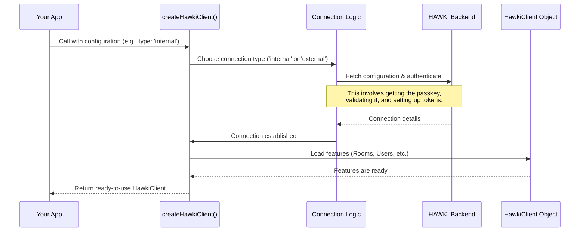

# Chapter 1: HawkiClient: Creation and Configuration

Building on the local development environment and tools introduced in [bin/env - Your local dev helper](bin-env-your-local-dev-helper-862670637.md), we're ready to utilize the `hawki-client` library to connect with the HAWKI backend. This library is your toolkit for building applications that communicate with the HAWKI backend. Before you can send messages, manage users, or do anything else, you first need to establish a connection.

Think of the `HawkiClient` as the master key to a high-tech building (the HAWKI backend). You can't just walk in; you need to go to the front desk, present your credentials, and get a key that's programmed just for you. The function `createHawkiClient` is that front desk, and your configuration is your set of credentials. Once you have the key, you can access all the features the building has to offer.

Our goal in this chapter is to learn how to request and receive this "master key" by creating and configuring our first `HawkiClient` instance.

### The Entry Point: `createHawkiClient`

Everything starts with a single, important function: `createHawkiClient`. This is an `async` function, meaning you'll need to use `await` when you call it. It takes one argument: a configuration object that tells HAWKI how you want to connect.

The most important setting in this configuration is `type`. This little property changes everything about how the connection is made. Let's look at the two types.

### Connection Type 1: `'internal'`

The `'internal'` type is for when your code is running directly inside the main HAWKI web application. It's like being an employee in the building—you have direct access, but you still need to prove who you are.

This type assumes a lot of information is already available on the web page. For authentication, it will ask for a **"passkey"**. This is a secret password that the user provides to decrypt their data.

Here's a minimal example of how you'd create a client for an internal application:

```javascript
import { createHawkiClient } from '@hawk-hhg/hawki-client';

const client = await createHawkiClient({
  type: 'internal',
  providePasskey: () => {
    // In a real app, you would show a login form here
    // and return the password the user enters.
    return 'user-secret-password-123';
  }
});

console.log('Hawki client is ready!');
```

In this snippet:
*   We import `createHawkiClient`.
*   We call it with a configuration object where `type` is `'internal'`.
*   The `providePasskey` function's job is to supply the user's secret passkey. Here, we've hardcoded it for simplicity, but in a real app, this is where you would prompt the user for their password.

### Connection Type 2: `'external'`

The `'external'` type is for when you're building a separate, third-party application that needs to connect to HAWKI. Think of it as being a visitor to the building. The security process is more involved.

Typically, an external connection requires a few extra steps:
1.  **A Broker Backend:** Your application can't talk to HAWKI directly with its secret keys. Instead, you'll have your own server that "brokers" or "proxies" the initial connection request.
2.  **User Approval:** The user needs to explicitly approve your application's request to access their HAWKI account. This is usually done by visiting a special URL.

Here is what creating an `'external'` client looks like:

```javascript
import { createHawkiClient } from '@hawk-hhg/hawki-client';

const client = await createHawkiClient({
  type: 'external',
  // URL to your own server that helps connect to HAWKI
  clientConfigUrl: 'https://my-app.com/api/hawki-connect',

  // This function is called when user approval is needed
  onConnectionRequired: async (connectUrl) => {
    console.log(`Please visit this URL to approve: ${connectUrl}`);
    // In a real app, you would show a QR code or a link
    // and wait for the user to complete the action.
  }
});
```

In this `external` example:
*   `clientConfigUrl` points to an endpoint on your own server. The `hawki-client` will contact this URL to get the necessary connection details.
*   `onConnectionRequired` is a function that you must provide. The library will call it with a unique `connectUrl`. Your job is to show this URL to the user. Once they visit it and approve the connection, `createHawkiClient` will finish its work and return the client object.

### What Happens Under the Hood?

When you call `createHawkiClient`, a precise sequence of events unfolds to get you a secure, working client. Let's visualize it.



Let's trace this flow in the code.

1.  **The Entry Point:**
    Your journey begins in `src/HawkiClient.ts` with the `createHawkiClient` function. Its first job is to validate your options and prepare for the connection.

    ```typescript
    // in src/HawkiClient.ts
    export async function createHawkiClient(options: HawkiClientOptions): Promise<HawkiClient> {
      // ... some setup ...
      
      const connection = await connect(options, log, bootLog, eventBus);

      await loadFeatures(connection, options);

      // ... more setup ...
      
      return connection.client;
    }
    ```
    As you can see, it calls a helper function named `connect` to do the heavy lifting.

2.  **The Router:**
    The `connect` function, also in `src/HawkiClient.ts`, acts like a traffic cop. It looks at `options.type` and directs the process to the correct specialist function.

    ```typescript
    // in src/HawkiClient.ts
    function connect(options: HawkiClientOptions, /*...*/) {
      if (options.type === 'internal') {
        return connectInternal(eventBus, options, log, bootLog);
      }
      if (options.type === 'external') {
        return connectExternal(eventBus, options, log, bootLog);
      }
      throw new Error(`Unsupported connection type: ...`);
    }
    ```
    This simple `if/else` is the critical branching point based on your configuration.

3.  **The Specialists:**
    The functions `connectInternal` (from `src/internal/connection/internal/connectInternal.ts`) and `connectExternal` (from `src/internal/connection/external/connectExternal.ts`) handle the unique logic for each connection type.
    *   `connectInternal` focuses on loading configuration from the web page and running the `providePasskey` function you gave it.
    *   `connectExternal` handles the loop of contacting your backend and calling `onConnectionRequired` until the user grants access.

4.  **Loading the Features:**
    Once the connection is successfully established, the `loadFeatures` function (in `src/HawkiClient.ts`) is called. It initializes all the different modules—like [Room Management](room-management-285498536.md) and [User and Profile Management](user-and-profile-management-20863976.md)—and attaches them to the client object that will be returned to you.

### Conclusion

You've just learned the most fundamental step in using `hawki-client`: creating and configuring the client instance.

You now know that:
*   Everything starts with the `createHawkiClient` async function.
*   The configuration object you provide is essential, and the `type` property (`'internal'` or `'external'`) is its most important setting.
*   `'internal'` is for use within the HAWKI frontend and requires a `providePasskey` function.
*   `'external'` is for third-party apps and involves a more complex flow with a broker backend and user approval via `onConnectionRequired`.

You've successfully obtained the "master key." Now, it's time to see what doors it can open.

In the next chapter, we will take a closer look at the object you just created and explore its main properties and capabilities.

Next: [The `HawkiClient` Object and its Features](the-hawkiclient-object-and-its-features-844629559.md)

