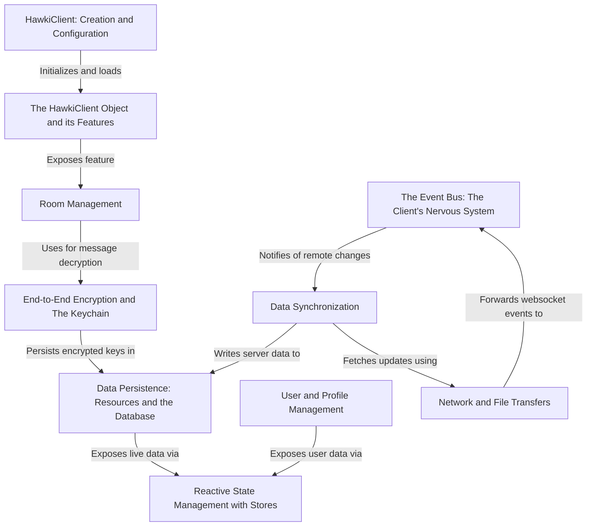

# Tutorial: hawki-client

The `hawki-client` is a JavaScript library designed to connect to a HAWKI backend, enabling developers to build applications with **secure, real-time communication**. Its core functionality includes chat room management, end-to-end encryption for messages, and local data persistence. The library is built on a *reactive programming model*, making it easy to create dynamic user interfaces that automatically update when data changes.

**Source Repository:** [git@github.com:hawk-digital-environments/hawki-package.git](git@github.com:hawk-digital-environments/hawki-package.git)

## Chapters

1. [Getting Started](getting-started-929492837.md)
1. [bin/env - Your local dev helper](bin-env-your-local-dev-helper-862670637.md)
1. [HawkiClient: Creation and Configuration](hawkiclient-creation-and-configuration-382472665.md)
1. [The `HawkiClient` Object and its Features](the-hawkiclient-object-and-its-features-844629559.md)
1. [Reactive State Management with Stores](reactive-state-management-with-stores-1007900773.md)
1. [User and Profile Management](user-and-profile-management-20863976.md)
1. [Room Management](room-management-285498536.md)
1. [End-to-End Encryption and The Keychain](end-to-end-encryption-and-the-keychain-1491275150.md)
1. [Data Synchronization](data-synchronization-1567356394.md)
1. [Data Persistence: Resources and the Database](data-persistence-resources-and-the-database-983608291.md)
1. [Network and File Transfers](network-and-file-transfers-715941119.md)
1. [The Event Bus: The Client's Nervous System](the-event-bus-the-client-s-nervous-system-8645510.md)
1. [Infrastructure](infrastructure-610545213.md)
1. [CI/CD Pipeline](ci-cd-pipeline-610418824.md)

