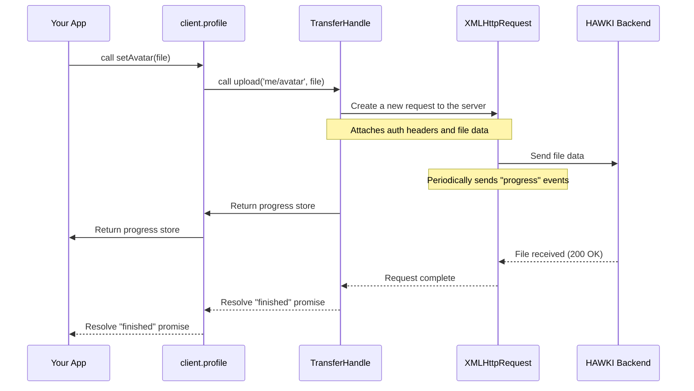

# Chapter 9: Network and File Transfers

In the [previous chapter on Data Persistence](data-persistence-resources-and-the-database-983608291.md), we saw how `hawki-client` stores its data in a local database for speed and offline access. But how does that data get to and from the HAWKI server in the first place? And how do we send things like messages or new profile pictures?

This chapter introduces the hidden engine that powers all communication: the `TransferHandle`. While you won't typically use it directly, understanding this component is like learning how the engine in your car works. You don't need to know it to drive, but it gives you a deeper appreciation for how everything runs so smoothly.

### The Problem: Talking to the Server Securely

Imagine you're in a secure building. To do anything—enter a room, access a file cabinet, use the printer—you need to show your ID badge. If you forget it, you can't do anything.

The `TransferHandle` is your automated ID-showing assistant for the HAWKI backend. Every time one of the library's features needs to talk to the server, it doesn't make the call itself. Instead, it asks the `TransferHandle`, which automatically attaches the necessary authentication "badge" (your API tokens) to the request, ensuring the server knows who you are and that your request is legitimate.

### The `TransferHandle`: Your All-in-One Communication Hub

The `TransferHandle` isn't just one thing; it's a collection of specialized tools for different kinds of communication.

*   **Standard API Calls (`requestJson`, `requestBlob`):** For most tasks, like fetching a user's profile or sending a text message, the library uses these methods. They are wrappers around the web's standard `fetch` API, but supercharged to handle authentication and errors automatically.
*   **Websocket Connection (`echo`):** For real-time updates, like seeing a new message pop up instantly, the `TransferHandle` manages a persistent connection to the server using a tool called Laravel Echo. This is the "live feed" that the [Data Synchronization](data-synchronization-1567356394.md) feature tunes into.
*   **File Uploads (`upload`):** Uploading files is a special task. To provide you with a nice progress bar (e.g., "34% complete"), the `TransferHandle` uses a different, older technology called `XMLHttpRequest` (XHR). This tool is perfectly suited for tracking the progress of large data transfers.

### How the Library Uses the `TransferHandle`

Let's revisit an example from our [User and Profile Management](user-and-profile-management-20863976.md) chapter: setting a new avatar.

You, the developer, write this simple and clean code:

```javascript
const upload = client.profile.setAvatar(someFile);

upload.progress.subscribe(p => console.log(`Progress: ${p.percent}%`));

await upload.finished();
```

Behind the scenes, the `client.profile` feature is delegating all the hard work to the `TransferHandle`. Conceptually, this is what the feature is doing on your behalf:

```javascript
// This is a conceptual example of what happens inside client.profile.setAvatar()
function setAvatar(file) {
  // 1. Get the internal TransferHandle
  const transfer = connection.transfer;
  
  // 2. Ask it to handle the upload to the 'me/avatar' endpoint
  const uploadTask = transfer.upload('me/avatar', file);

  // 3. Return the task object so the user can track it
  return uploadTask;
}
```
The `ProfileFeature` doesn't need to know how to build a request, add headers, or track progress. It just hands the file and the destination to the `TransferHandle` and trusts it to do the job correctly. This is a powerful design pattern that keeps the feature code clean and focused on its specific task.

### What Happens Under the Hood?

Let's follow the journey of a file upload to see the `TransferHandle` in action.



This diagram shows how the request is passed down the line, from the high-level feature you use all the way down to the low-level browser API that actually does the sending.

#### 1. The Communications Factory: `createTransferHandle`

When your client first connects, the `createTransferHandle` function in `src/internal/connection/transfer/TransferHandle.ts` is called. It's like a factory that assembles all the necessary communication tools.

```typescript
// A simplified view from src/internal/connection/transfer/TransferHandle.ts
export function createTransferHandle(
  config: CommonConnectionConfig,
  authenticationHeaders: Record<string, string>,
  /* ...other dependencies... */
) {
  // ...
  const fetchJson = createJsonFetchWrapper(/*...*/);
  const upload = createFileUploadHandler(
    authenticationHeaders,
    /*...*/
  );
  const echo = new Echo({/*...*/});
  // ...
  return { requestJson, upload, echo, /*...*/ };
}
```
This factory function takes the `authenticationHeaders` and "bakes them into" the tools it creates, like `upload`. This is how every request gets authenticated automatically.

#### 2. The JSON Messenger: `createJsonFetchWrapper`

When you update your bio, the profile feature uses `requestJson`. This is handled by a wrapper that knows how to speak "JSON" to the server.

```typescript
// A simplified view from src/internal/connection/transfer/jsonFetchWrapper.ts
function createJsonFetchWrapper(transferFetch, eventBus) {
  return async (path, body, options) => {
    // Stringify the data to send
    if (body) { options.body = JSON.stringify(body); }

    const response = await transferFetch(path, options);

    // If the server sends back any data changes, notify the rest of the app.
    if (response.data['_hawki_sync_log']) {
      eventBus.dispatchSyncLogInResponseEvent(response.data['_hawki_sync_log']);
    }

    return response.data;
  };
}
```
Notice the interesting piece at the end: if the server's response includes a `_hawki_sync_log`, it immediately dispatches this information to [The Event Bus: The Client's Nervous System](the-event-bus-the-client-s-nervous-system-8645510.md). This keeps your local data perfectly in sync, even as a side-effect of another action!

#### 3. The Upload Specialist: `createFileUploadHandler`

For file uploads, the `upload` function uses `XMLHttpRequest` because of its excellent progress-tracking capabilities.

```typescript
// A simplified view from src/internal/connection/transfer/uploadFile.ts
const uploadSingleFile = async (file: File): Promise<string | null> => {
  return new Promise((resolve, reject) => {
    const xhr = new XMLHttpRequest();

    // The magic line for progress tracking!
    xhr.upload.addEventListener('progress', (event) => {
      const percent = Math.round((event.loaded / event.total) * 100);
      fileProgressMap.get(file)?.set(percent);
    });
    
    // ... code to handle success and failure ...

    xhr.open('POST', url, true);
    // ... add authentication headers ...
    xhr.send(formData);
  });
};
```
This snippet clearly shows the core logic. An `XMLHttpRequest` is created, and a `progress` event listener is attached to its `upload` property. This listener is what updates the reactive store that your UI is subscribed to, giving you that smooth progress bar effect.

### Conclusion

You've now toured the engine room of `hawki-client` and seen the `TransferHandle` in action.

You have learned that:
*   The `TransferHandle` is the low-level workhorse for all network communication, though you rarely interact with it directly.
*   It automatically handles authentication for all API calls.
*   It uses `fetch` for standard data requests (`requestJson`) and `XMLHttpRequest` for file uploads to provide progress tracking.
*   It also manages the real-time websocket connection for live updates.
*   This separation of concerns allows the high-level features (`client.rooms`, `client.profile`) to remain simple and focused.

We've mentioned that the `TransferHandle` uses the `EventBus` to announce when new sync data is available. All the different parts of `hawki-client`—sync, persistence, networking—need a way to talk to each other. How do they do it? The final chapter will introduce the central nervous system that makes this collaboration possible.

Next: [The Event Bus: The Client's Nervous System](the-event-bus-the-client-s-nervous-system-8645510.md)

