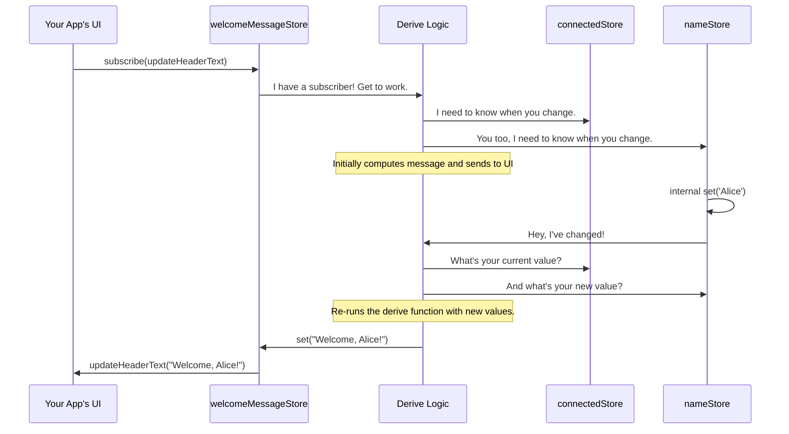

# Chapter 3: Reactive State Management with Stores

In the [previous chapter](the-hawkiclient-object-and-its-features-844629559.md), we introduced the `client.connected` property and called it "reactive." We saw that you could `get()` its current value and `subscribe()` to its changes. This reactive pattern is not just a one-off feature; it's the very foundation of how data is managed in `hawki-client`.

This chapter will dive deep into this concept, showing you how these "reactive stores" can make building complex, auto-updating user interfaces incredibly simple.

### The Problem: Keeping Your UI in Sync

Imagine you're building a chat application. A user's name might appear in several places on the screen: in the header, next to their messages, and in the user list.

Now, what happens if the user changes their name? You would have to write code to find every single one of these places and update them manually. It's tedious, error-prone, and gets much harder as your application grows.

This is the problem that reactive state management solves. Instead of you chasing down data changes and updating the UI, the data itself will announce when it has changed, and the UI will automatically react.

### The Solution: The `ReactiveStoreFront`

Think of a `ReactiveStoreFront` as a magic, public bulletin board. This board can only hold one notice at a time. The library exposes most of its dynamic data—like connection status, user profiles, or room details—through these magical bulletin boards.

A `ReactiveStoreFront` has three main actions you can perform:

1.  **`get()`**: Walk up to the board and read the notice that's currently posted.
2.  **`set()`**: Take down the old notice and pin a new one up.
3.  **`subscribe(callback)`**: Tell the board's manager, "Hey, please call me on this number (the `callback` function) every single time a new notice is posted."

Let's use the `client.connected` store we saw earlier to demonstrate these actions.

```javascript
// client.connected is a ReactiveStoreFront that holds a boolean value.

// 1. Get the current value
const isConnectedNow = client.connected.get();
console.log('Am I connected right now?', isConnectedNow);

// 2. Subscribe to changes
const unsubscribe = client.connected.subscribe(newStatus => {
  // This code will run every time the connection status changes.
  document.body.style.backgroundColor = newStatus ? 'white' : 'lightgray';
  console.log('Connection status has changed to:', newStatus);
});

// Later, if you want to stop listening:
// unsubscribe();
```

In this example, we first `get()` the status to see where we are. Then, we `subscribe()` to any future changes. Our subscription function updates the page's background color. Now, if the connection drops, the background automatically turns light gray. When it returns, it turns white again—no manual checks needed!

### The Real Superpower: `derive()`

Subscribing to one piece of data is useful, but the real magic happens when you need to create a new piece of data that depends on *others*.

Let's expand our use case. We want to display a welcome message at the top of our app.

*   If we are disconnected, it should say "Connecting...".
*   If we are connected but don't know the user's name yet, it should say "Welcome!".
*   If we are connected and we have the user's name, it should say "Welcome, Alice!".

This welcome message a **derived value**. It depends on two other pieces of data: the connection status and the user's name.

The `derive()` method lets you create a *new* store from one or more *source* stores. This new derived store will automatically update whenever any of its sources change.

Let's see it in action. We'll use `client.connected` and another store from the [User and Profile Management](user-and-profile-management-20863976.md) feature, `client.profile.name`.

```javascript
const connectedStore = client.connected;
const nameStore = client.profile.name; // This is a ReactiveStoreFront<string>

// Create a new, derived store for our welcome message
const welcomeMessageStore = connectedStore.derive(
  'welcomeMessage', // A unique key for this new store
  (isConnected, name) => {
    if (!isConnected) return 'Connecting...';
    if (!name) return 'Welcome!';
    return `Welcome, ${name}!`;
  },
  [nameStore] // An array of other source stores
);

// Now, we just subscribe to our single, smart store!
welcomeMessageStore.subscribe(message => {
  // This will automatically update our UI header
  document.getElementById('header-text').innerText = message;
});
```

That's it! We've described the logic for our welcome message in one place. Now, `welcomeMessageStore` will do all the work.
*   When the app first loads, `isConnected` might be `true` but `name` is `undefined`. The store's value becomes "Welcome!".
*   Later, when the user's profile is loaded and `nameStore.set('Alice')` is called internally, `welcomeMessageStore` automatically re-runs your function. Its value becomes "Welcome, Alice!", and your UI updates.
*   If the internet connection drops, `connectedStore` becomes `false`. `welcomeMessageStore` reacts again, and its value becomes "Connecting...".

You've created a piece of UI that manages itself, all thanks to `derive()`.

### What Happens Under the Hood?

How does `derive()` work its magic? It's like setting up a chain of command. When you create a derived store, you're essentially hiring a little manager who watches the source stores for you.

Let's visualize the flow for our `welcomeMessageStore`.



This "Derive Logic" is primarily handled by the `createDerivedStore` function found in `src/internal/resources/stores/DerivedStore.ts`. Let's look at a simplified version of its code.

```typescript
// A simplified view from src/internal/resources/stores/DerivedStore.ts
export function createDerivedStore(
  sourceStores: ReactiveStore[],
  deriveFunction: (...args: any[]) => any
) {
  // 1. Create a brand new store for the final result.
  const derivedStore = createGenericStore();

  const recompute = () => {
    // 2. Get the latest values from all source stores.
    const values = sourceStores.map(store => store.get());
    // 3. Run the logic you provided.
    const result = deriveFunction(...values);
    // 4. Update the derived store with the new result.
    derivedStore.set(result);
  };

  // 5. For each source store, subscribe to its changes.
  for (const store of sourceStores) {
    store.subscribe(() => recompute());
  }

  recompute(); // Run once immediately to get the initial value.
  return derivedStore;
}
```

The process is beautifully simple:
1.  A new, empty store (`derivedStore`) is created to hold the result.
2.  A function (`recompute`) is defined to perform the logic: get values, combine them, and set the result.
3.  The system subscribes the `recompute` function to every single one of the source stores.
4.  Whenever any source store changes, `recompute` is triggered, and the `derivedStore` is updated.
5.  Since your UI is subscribed to `derivedStore`, it updates automatically.

This pattern of creating stores that are lazily computed and automatically updated is at the heart of what makes `hawki-client` so powerful and easy to work with.

### Conclusion

In this chapter, you've unlocked the core concept of reactivity in `hawki-client`.

You now know that:
*   Most dynamic data is wrapped in `ReactiveStoreFront` objects.
*   You can interact with stores using `get()`, `set()`, and `subscribe()`.
*   The `derive()` method is a powerful tool for creating new, memoized stores that depend on the values of others.
*   This reactive system frees you from the chore of manually tracking state changes and keeping your UI in sync.

You've learned how data flows through the client. Now, let's start looking at the specific data you can work with. In the next chapter, we'll explore one of the most fundamental data models: users and their profiles.

Next: [User and Profile Management](user-and-profile-management-20863976.md)

