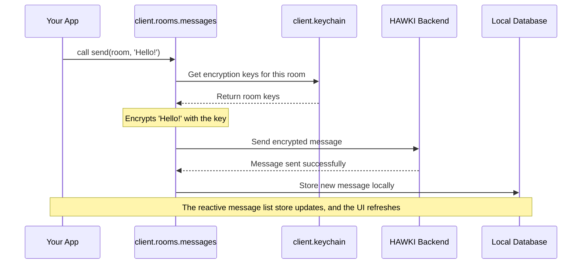

# Chapter 5: Room Management

In the [previous chapter](user-and-profile-management-20863976.md), we learned how to manage your identity and look up other users. Now that we know *who* we are talking to, let's explore *where* these conversations happen: in chat rooms.

This chapter introduces `client.rooms`, the most comprehensive feature module in `hawki-client`. It's your one-stop-shop for everything related to chat rooms, from creating them to sending messages inside them.

### Your Organized Workspace: `client.rooms`

Imagine you're managing a shared digital workspace. You have one central dashboard, `client.rooms`, for an overview of all the project rooms. From this dashboard, you can perform high-level actions like creating a new room or seeing a list of all existing rooms.

But for specific tasks within a room, you have specialized assistants:
*   Want to read or send messages? You talk to the "Messages" assistant (`client.rooms.messages`).
*   Need to see who's in the room or manage their roles? You ask the "Members" assistant (`client.rooms.members`).
*   Want to see who's typing right now? You glance at the "Typing Indicator" panel (`client.rooms.typing`).

This is exactly how `client.rooms` is structured. It's a main feature that provides sub-handles for more specific, domain-driven tasks. This keeps the API clean, organized, and easy to understand.

### Core Operations: Creating and Listing Rooms

Let's start with the basics. The `client.rooms` object itself allows you to create, list, and update rooms directly.

#### Listing All Your Rooms

The most common first step is to get a list of all rooms you're a member of. The `list()` method returns a reactive store that contains an array of `Room` objects, automatically sorted by the most recent activity.

```javascript
const roomListStore = client.rooms.list();

roomListStore.subscribe(rooms => {
  console.log(`You are a member of ${rooms.length} rooms.`);
  // In a real app, you would render this list to the UI.
  // For example: <ul>...<li>Room 1</li>...</ul>
});
```
Because this is a reactive store, as you are added to new rooms or as activity happens, this list will update automatically, keeping your UI perfectly in sync.

#### Creating a New Room

Creating a new chat room is a single, asynchronous call to `create()`. Just provide a name, and you're good to go. The current user will automatically be made an administrator of the new room.

```javascript
async function createNewProjectRoom() {
  const newRoom = await client.rooms.create({
    name: 'Project Phoenix Planning'
  });

  console.log(`Successfully created room: ${newRoom.name} (ID: ${newRoom.id})`);
}
```
This function handles all the backend communication and returns the freshly created `Room` object.

### The Specialized Assistants: Messages, Members, and Typing

Now let's dive into the sub-handles that make `client.rooms` so powerful.

#### `client.rooms.messages`: The Communication Desk

This handle is your go-to for all message-related actions within a specific room.

To list messages, you call `messages.list(room)`. To send one, you call `messages.send(room, content)`.

```javascript
// Assume 'selectedRoom' is a Room object we got from client.rooms.list()

// List all messages in the selected room
const messageStore = client.rooms.messages.list(selectedRoom);
messageStore.subscribe(messages => {
  console.log(`Displaying ${messages.length} messages.`);
  // ... render messages to the screen
});

// Send a new message to that room
await client.rooms.messages.send(
  selectedRoom,
  'Hello everyone, let’s get started!'
);
```
Here, we first subscribe to the message list for a `selectedRoom`. Then, we send a new message. As soon as the message is sent, the `messageStore` will automatically update, and our subscription will run again with the new message included.

#### `client.rooms.members`: The Participant Roster

This handle lets you manage the people inside a room. You can see who is a member, what their role is (admin, member), and even invite new people.

```javascript
// Again, assume 'selectedRoom' is a Room object

// Get a reactive list of all members in the room
const memberStore = client.rooms.members.list(selectedRoom);

memberStore.subscribe(members => {
  const names = members.map(m => m.user.displayName).join(', ');
  console.log(`Members in this room: ${names}`);
});
```
This is great for building a user list panel for your chat room. The `list()` method cleverly combines data from the room's member list with user profiles to give you rich objects that include the user's name, avatar, and more.

#### `client.rooms.typing`: The Real-Time Status Board

Want to show that little "..." indicator when someone is typing? The `typing` handle makes this incredibly simple.

It provides a reactive store of who is currently typing, and methods to announce your own typing status to others.

```javascript
// Assume 'selectedRoom' is a Room object

// Subscribe to see who is typing
const typingUsersStore = client.rooms.typing.state(selectedRoom);

typingUsersStore.subscribe(users => {
  if (users.length > 0) {
    const names = users.map(u => u.displayName).join(', ');
    console.log(`${names} is typing...`);
  } else {
    console.log(''); // Clear the typing indicator
  }
});

// When your user starts typing in an input field...
// client.rooms.typing.start(selectedRoom);

// When they stop or send the message...
// client.rooms.typing.stop(selectedRoom);
```
By subscribing to `typing.state()`, your UI can react instantly to typing events from other users.

### What Happens Under the Hood?

The `RoomFeature` is a master of delegation. It constructs its specialized sub-handles and then exposes them to you. When you call a method like `client.rooms.messages.send()`, a coordinated effort begins.

Let's visualize the flow of sending a message.



This flow shows a beautiful separation of concerns:
1.  **The App:** Simply calls `send` with plain text.
2.  **The `RoomMessagesHandle`:** Orchestrates the process. It knows it needs to encrypt the message before sending.
3.  **The `Keychain`:** Is the security expert. It securely provides the necessary encryption keys, as you'll learn in [End-to-End Encryption and The Keychain](end-to-end-encryption-and-the-keychain-1491275150.md).
4.  **The `Database`:** Acts as a local cache, ensuring your app feels fast and responsive. We'll cover this in [Data Persistence: Resources and the Database](data-persistence-resources-and-the-database-983608291.md).

Let's look at the source code to see how `RoomFeature` is put together.

In `src/internal/rooms/RoomFeature.ts`, you can see the feature being defined. It creates instances of the sub-handles and then returns them as properties.

```typescript
// A simplified view from src/internal/rooms/RoomFeature.ts
export const RoomFeature = defineFeature((connection) => {
  // 1. Create the specialist assistants
  const typingHandle = createRoomTypingHandle(connection);
  const membersHandle = createRoomMembersHandle(connection);
  const messagesHandle = createRoomMessagesHandle(connection, membersHandle);

  // ... functions for create(), list(), update() ...

  // 2. Return everything in an organized object
  return {
    create,
    list,
    update,
    // ... more core functions
    get typing() { return typingHandle; },
    get messages() { return messagesHandle; },
    get members() { return membersHandle; }
  };
});
```
This code clearly shows the "manager and specialists" structure. The `RoomFeature` initializes all its helpers (`typingHandle`, `membersHandle`, etc.) and then exposes them through `get` properties, which is why you can access them as `client.rooms.typing`. This lazy loading and clear structure makes the entire `RoomFeature` powerful yet easy to maintain and understand.

### Conclusion

You've now explored the most feature-rich part of `hawki-client`. You have a solid understanding of how to manage the entire lifecycle of a chat room.

You have learned:
*   `client.rooms` is the central hub for all room-related functionality.
*   You can perform high-level operations like `create` and `list` directly on `client.rooms`.
*   For specific tasks, you use the specialized sub-handles: `messages`, `members`, and `typing`.
*   This hierarchical design provides a clean, organized, and powerful API for building chat features.
*   Behind the scenes, these handles work together with other features like the `Keychain` and the local database to provide a secure and responsive experience.

We've mentioned encryption several times in this chapter. Sending a message involves encrypting its content so that only room members can read it. How does this work? The next chapter will pull back the curtain on this critical security feature.

Next: [End-to-End Encryption and The Keychain](end-to-end-encryption-and-the-keychain-1491275150.md)

