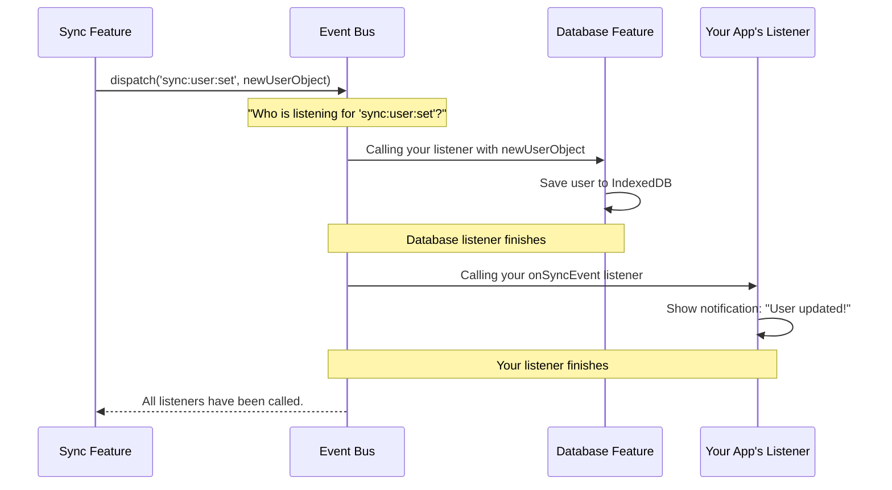

# Chapter 10: The Event Bus: The Client's Nervous System

In the [previous chapter on Network and File Transfers](network-and-file-transfers-715941119.md), we saw how different parts of `hawki-client` work together to send and receive data. We saw that the networking layer can notify other parts of the app when it receives new data. But how does that notification happen? How do all the specialized features of the library—sync, database, rooms, encryption—communicate with each other without becoming a tangled mess?

This chapter introduces the component that makes it all possible: the Event Bus. Think of it as the central nervous system of the `hawki-client`. It's the invisible web of communication that allows one part of the library to send out a signal (an "event") and have any other part listen and react to it.

### The Problem: A Town Without a PA System

Imagine a large, bustling town where every department—the post office, the fire station, the library—works independently. Now, imagine a big shipment of new books arrives at the post office. How does the post office tell the library? It would need a direct phone line to the library. And if the fire station also needs to know about big shipments, the post office needs another direct line to them. This quickly becomes a tangled mess of phone lines.

The Event Bus is like a town-wide PA system. The post office (let's say, the [Data Synchronization](data-synchronization-1567356394.md) feature) can simply make an announcement: "New data has arrived!" Any other department that cares about new data, like the library ([Data Persistence: Resources and the Database](data-persistence-resources-and-the-database-983608291.md)) or the town crier (your UI), can listen to the PA system and react.

This approach is called **decoupling**. The feature dispatching the event doesn't need to know who is listening. And the features listening don't need to know who dispatched the event. They just need to know about the Event Bus itself.

### Listening to the Client's Heartbeat

While the Event Bus is mostly used for internal communication, `hawki-client` exposes some of the most useful events through the `client.events` feature. This allows you to "hook into" the client's lifecycle and react to important state changes.

Let's look at a very common use case: showing a banner when the user's internet connection is lost. The `onDisconnect` event is perfect for this.

```javascript
client.events.onDisconnect(() => {
  // In a real app, you would show a notification banner.
  console.log('Connection lost! You are now offline.');
});
```

That's it! You've registered a "listener" for the `disconnect` event. Whenever the client disconnects from the server for any reason, `hawki-client` "dispatches" this event, and your function is automatically called.

### A Tour of Important Events

The `client.events` handle gives you access to several powerful listeners. Here are a few key ones:

#### `onStorageChange`

This is one of the most powerful events. It fires whenever a record in the local database changes, for any reason—whether it's from the sync process, an action you took, or even a change in another browser tab!

It's a fantastic tool for building logic that needs to react to data changes at a low level.

```javascript
// Listen for when any 'room' record is created or updated.
client.events.onStorageChange('room', 'set', (roomRecord) => {
  console.log(`Room "${roomRecord.name}" was just updated in the database!`);
});
```
This gives you a way to observe the database directly, which is useful for debugging or complex UI integrations that go beyond what [Reactive Stores](reactive-state-management-with-stores-1007900773.md) provide.

#### `onInit` and `onDisconnect`

These are key lifecycle events:
*   `onInit`: Fires once the client is fully connected and initialized, right before `createHawkiClient` finishes. It's the perfect place to run setup code that depends on a ready client.
*   `onDisconnect`: Fires when the client is disconnected. Useful for cleaning up UI state or showing "offline" indicators.

```javascript
// Note: onInit is called on the internal eventBus, not client.events
connection.eventBus.onInit(client => {
  console.log('The client is ready to rock and roll!');
});
```

#### Low-level Websocket and Sync Events

The Event Bus also handles all real-time communication. For example, the "typing indicator" feature from the [Room Management](room-management-285498536.md) chapter is built entirely on the Event Bus.
*   When a user starts typing, the library calls `dispatchRoomWhisperMessage`.
*   Other clients in the room have a listener for `onRoomWhisperMessage` that receives the event and updates the UI.

You typically won't use these low-level events directly, as features like `client.rooms.typing` provide a much nicer interface. But it's valuable to know that the Event Bus is the engine powering them all.

### What Happens Under the Hood?

Let's demystify how the Event Bus orchestrates all this communication. At its heart, it's a simple but elegant pub/sub (publish/subscribe) system.

Let's visualize the flow when the sync process receives a new user profile and notifies the rest of the application.


The `Sync` feature doesn't know about the `Database` or `YourApp`. It just makes an announcement on the Event Bus, and the bus takes care of notifying all registered subscribers.

Let's peek into the code in `src/internal/events/EventBus.ts` to see a simplified version of how this works.

Conceptually, the Event Bus is just a map where keys are event names and values are lists of listener functions.

```javascript
// This is a highly simplified model of the EventBus

// A map to store all our listeners
const listeners = new Map<string, Function[]>();

// The 'on' method registers a new listener
function on(eventType, listener) {
  if (!listeners.has(eventType)) {
    listeners.set(eventType, []);
  }

  // Add the function to the list for this event
  listeners.get(eventType).push(listener);
}

// The 'dispatch' method calls all registered listeners
function dispatch(eventType, message) {
  const eventListeners = listeners.get(eventType);

  if (eventListeners) {
    for (const listener of eventListeners) {
      listener(message); // Call each listener with the event data
    }
  }
}
```

The real `EventBus.ts` is more advanced, with features like:
*   **Priorities:** You can specify a priority for your listener to control whether it runs before or after others. This is why you see `LOWEST_PRIORITY` and `HIGHEST_PRIORITY` values.
*   **Handlers:** The Event Bus can delegate responsibility for certain types of events. For example, all websocket events are handled by a special `WebsocketEventHandler` (from `src/internal/events/websockets.ts`), which knows how to interact with Laravel Echo to subscribe to the correct real-time channels. This makes the bus incredibly flexible and extensible.

When you call a friendly method like `client.events.onStorageChange('user', 'set', ...)` it's simply a convenient wrapper that calls the underlying `on()` method with a specially formatted event name, like `storage:change`.

```typescript
// in src/internal/events/EventBus.ts
const onStorageChange = <TResourceName extends ResourceName>(
  resourceName: TResourceName,
  action: 'set' | 'remove' | 'all',
  listener: EventListener<ResourceStoredType<TResourceName>>,
  priority?: number
): () => void =>
  // A listener that filters events before passing them to you
  addStorageChangeListener(({resourceName: rn, action: a, record}) => {
    if (rn === resourceName && (action === 'all' || a === action)) {
      return listener(record as any);
    }
  }, priority);
```
This shows how the specific `onStorageChange` is built on top of a more generic `addStorageChangeListener`, which in turn registers a listener on the `storage:change` event. The Event Bus provides a layered architecture, from low-level generic events to high-level, specific ones.

### Conclusion

You've now reached the end of our core concepts tour and explored the central nervous system of `hawki-client`.

You have learned that:
-   The **Event Bus** is the decoupling mechanism that allows different parts of the library to communicate without direct dependencies.
-   It works on a **publish/subscribe** model, where features can dispatch events and others can listen for them.
-   You can hook into key lifecycle and data events using methods on `client.events`, like `onDisconnect` and `onStorageChange`.
-   This system is the invisible engine that powers many of `hawki-client`'s real-time and reactive features.

You now have a complete, high-level picture of how `hawki-client` works—from creating a client and managing reactive data to understanding its security, synchronization, and internal communication patterns. You are well-equipped to start building powerful, responsive, and secure applications with `hawki-client`. Happy coding

## Laying the Foundation: Infrastructure Ahead

With a solid grasp of the Event Bus and the core mechanics powering `hawki-client`, we're ready to shift gears. While the Event Bus keeps everything humming internally, true application scalability and reliability depend on a robust setup beneath it all. In the next chapter, we'll explore the infrastructure that supports your projects—from deployment strategies and environment management to tools for monitoring and scaling.

[Infrastructure](infrastructure-610545213.md)


