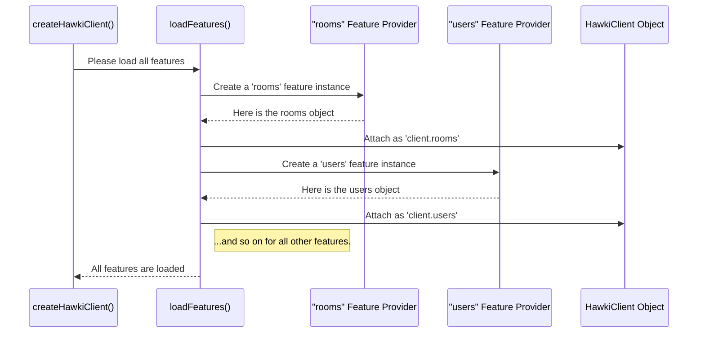

# Chapter 2: The `HawkiClient` Object and its Features

In [Chapter 1: HawkiClient: Creation and Configuration](hawkiclient-creation-and-configuration-382472665.md), you successfully created your first `HawkiClient` instance. You went through the "front desk," provided your credentials, and received your "master key." Now, what can you do with this key?

The object returned by `createHawkiClient` is your central command center for interacting with HAWKI. It's the most important object in the entire library. This chapter will introduce you to its structure and how you'll use it to access all the cool functionalities the library has to offer.

### A Well-Organized Toolbox

Imagine you were given a toolbox. A bad toolbox would just have all the tools—screwdrivers, hammers, wrenches—tossed into one big pile. You'd have to dig around every time you needed something. A good toolbox, however, has compartments: one for screwdrivers, one for sockets, one for hammers. It's organized, clean, and easy to use.

The `HawkiClient` object is like that well-organized toolbox. Instead of giving you hundreds of functions in one giant list, it groups them into logical categories called **Features**.

Each feature is a property on the `client` object that deals with a specific area of functionality.

*   Want to manage chat rooms? Use `client.rooms`.
*   Need to look up another user's profile? Use `client.users`.
*   Want to use HAWKI's AI capabilities? Use `client.ai`.

This modular design makes the API predictable and easy to explore. Let's see it in action.

```javascript
// Assume 'client' is the object we got from createHawkiClient()

// To work with rooms, access the .rooms feature
await client.rooms.getAll();

// To find a user, access the .users feature
const user = await client.users.getById('some-user-id');

// To update your own profile, access the .profile feature
await client.profile.update({ name: 'A New Name' });
```

In this example, you can see the clear pattern: `client.featureName.method()`. This organized structure helps you quickly find the tools you need for the job. We will explore each of these features in detail in later chapters, like [User and Profile Management](user-and-profile-management-20863976.md) and [Room Management](room-management-285498536.md).

### The Connection Status Light: `client.connected`

Aside from all its feature modules, the `client` object has one more special property: `connected`.

Think of `connected` as a live status light on your dashboard. It tells you, in real-time, whether your client is currently connected to the HAWKI backend. This is not just a simple `true` or `false` value; it's a **reactive** property.

"Reactive" means you can do two things with it:
1.  Get its current value at any time.
2.  "Subscribe" to it, so your code is automatically notified whenever the value changes.

```javascript
// 1. Get the current connection status
const isNowConnected = client.connected.get();
console.log(`Client is currently connected: ${isNowConnected}`);

// 2. Subscribe to be notified of future changes
client.connected.subscribe(newStatus => {
  if (newStatus) {
    console.log('Great! We have successfully reconnected!');
  } else {
    console.log('Oh no! The connection was lost.');
  }
});
```

This reactive pattern is incredibly powerful and is used throughout `hawki-client` for managing data that changes over time. We will dedicate an entire chapter to this concept in [Reactive State Management with Stores](reactive-state-management-with-stores-1007900773.md). For now, just remember that `client.connected` is your go-to source of truth for the connection's health.

### What Happens Under the Hood?

How does the `client` object get all these features attached to it? It happens right at the end of the `createHawkiClient` process, in a step called `loadFeatures`.

Let's visualize it. When `createHawkiClient` is called, it's like an assembly line for your client object. After establishing the connection, it moves to a station where all the feature modules are attached.



Let's trace this on the code level.

1.  **The Menu of Features**

    Inside `src/HawkiClient.ts`, there is a constant object named `features`. It acts as a menu or a directory of all available features in the library.

    ```typescript
    // in src/HawkiClient.ts
    export const features = {
      ai: AiFeature,
      sync: SyncFeature,
      events: EventFeature,
      rooms: RoomFeature,
      users: UserFeature,
      files: FileFeature,
      profile: ProfileFeature,
      // ...and so on
    } as const;
    ```
    Each value (like `AiFeature` or `RoomFeature`) is a "provider" function that knows how to create its specific feature module.

2.  **Assembling the Features**

    The `loadFeatures` function (also in `src/HawkiClient.ts`) iterates through this `features` menu. For each entry, it calls the provider function to create the feature instance and then stores it.

    ```typescript
    // A simplified view from src/HawkiClient.ts
    async function loadFeatures(connection: Connection, /*...*/) {
      // Loop over every feature in the 'features' menu
      for (const [key, featureProvider] of Object.entries(features)) {
        // Create the feature (e.g., the 'rooms' object)
        const instance = await featureProvider(connection, ...);
        
        // Store it in a map for later
        connection.features.set(key, instance);
      }
    }
    ```

3.  **The Smart Receptionist (Proxy)**

    So the features are created and stored. But how does typing `client.rooms` magically give you the right object? The `client` object is not a regular JavaScript object; it's a special `Proxy`.

    Think of a `Proxy` as a smart receptionist. When you walk up and ask for the "Rooms Department" (`client.rooms`), the receptionist doesn't contain the whole department. Instead, they look in their directory (the `connection.features` map) and instantly forward your request to the correct place.

    This logic lives in `src/internal/connection/createConnection.ts`.

    ```typescript
    // A simplified view from src/internal/connection/createConnection.ts
    const client = new Proxy(/*...*/, {
      get(target, property) {
        // If you ask for a property like 'rooms'...
        if (features.has(property as any)) {
          // ...the receptionist finds it in the map and returns it.
          return features.get(property as any);
        }
        
        // ...otherwise, handle it normally.
      }
    });
    ```
    This clever design keeps the main `client` object lightweight while providing easy, organized access to all its powerful features.

### Conclusion

You've now peeked inside the "master key" and understand its design.

-   The `HawkiClient` object is your main gateway to all library functionality.
-   It is organized into **Features** (e.g., `client.rooms`, `client.users`) to keep the API clean and predictable.
-   It provides a reactive `client.connected` property to monitor the connection status.
-   This modular structure is built dynamically when the client is first created.

You now have a solid mental model of how to navigate the `hawki-client` library. We keep mentioning this "reactive" concept with `get()` and `subscribe()`. It's time to pull back the curtain on this powerful pattern.

Next: [Reactive State Management with Stores](reactive-state-management-with-stores-1007900773.md)

