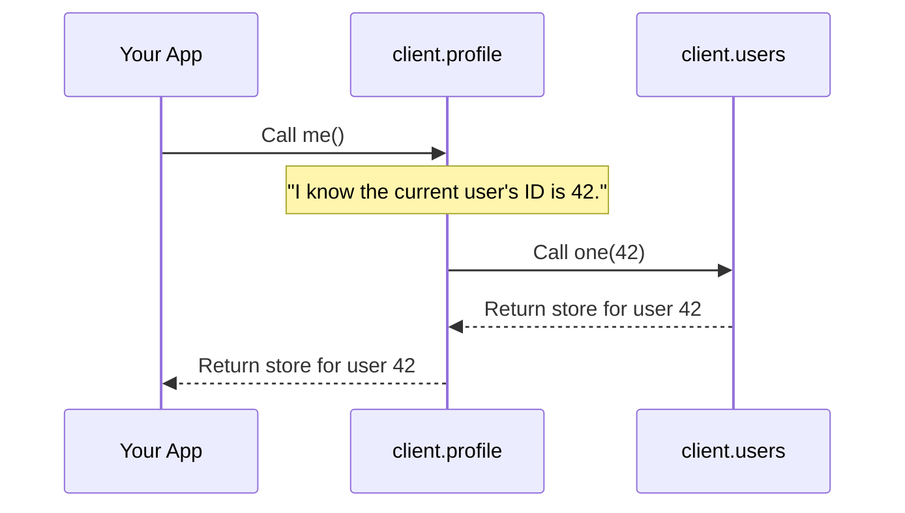
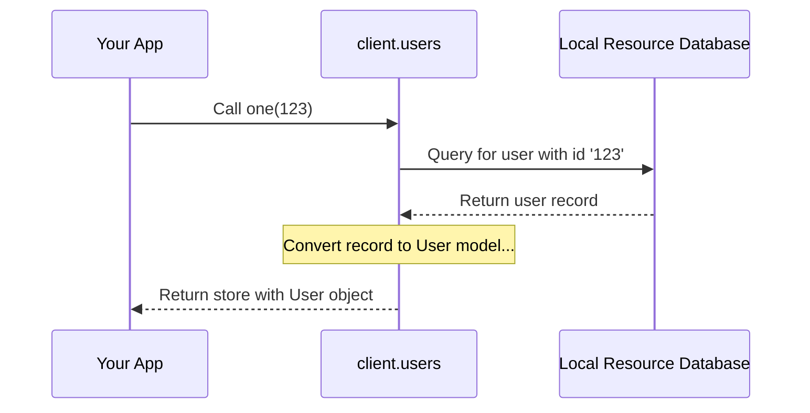

# Chapter 4: User and Profile Management

In the [previous chapter](reactive-state-management-with-stores-1007900773.md), we explored how `hawki-client` uses reactive stores to manage data that changes over time. Now, let's look at one of the most common types of data you'll work with: users.

Every collaborative application revolves around its users. You need to know who you are, update your own information, and see who else is in a conversation. In `hawki-client`, this is handled by two distinct but related features: `client.users` and `client.profile`. This chapter will teach you how to use them to manage user data and your personal profile.

### The Phonebook and Your Wallet

To understand the difference between `client.users` and `client.profile`, let's use an analogy.

*   `client.users` is like a public company phonebook. You can use it to look up information about *any* user you have access to—their name, their department (or bio), and their photo. It's a read-only directory.
*   `client.profile` is like your personal wallet and business card. It's specifically for managing *your own* identity. You can get your own details quickly, update your name, change your photo, or write a new bio. You can't use your wallet to change someone else's business card.

This separation keeps things clean: `users` is for looking up data, and `profile` is for acting on your own data.

### Managing Your Own Profile: `client.profile`

Let's start with the most common task: working with the currently logged-in user. The `client.profile` feature is your dedicated toolkit for this.

#### Getting Your Own User Data

How do you get your own profile? The `me()` method gives you a reactive store containing your user object. Since it's a store, you can `subscribe` to it and your UI will update automatically if your profile ever changes.

```javascript
// Get the reactive store for the current user's profile
const myProfileStore = client.profile.me();

// Subscribe to display your name and bio
myProfileStore.subscribe(myProfile => {
  if (myProfile) {
    document.getElementById('name').innerText = myProfile.displayName;
    document.getElementById('bio').innerText = myProfile.bio;
  }
});
```
In this snippet, we get the store from `client.profile.me()` and subscribe to it. Now, any part of our app that updates the profile will automatically trigger this code, keeping our UI perfectly in sync.

#### Updating Your Details

What if you want to change your display name or bio? The `update()` method lets you do just that. You pass it an object with the fields you want to change.

```javascript
async function saveNewBio() {
  const newBio = 'Learning to use hawki-client!';

  try {
    await client.profile.update({ bio: newBio });
    console.log('Profile updated successfully!');
  } catch (error) {
    console.error('Failed to update profile:', error);
  }
}
```
Here, we call `client.profile.update()` with a new bio. The library sends this change to the HAWKI backend. Once it succeeds, other parts of your app subscribed to `client.profile.me()` will automatically receive the updated profile!

#### Setting a New Avatar

Changing your profile picture is just as simple. The `setAvatar()` method takes a `File` object (which you can get from an `<input type="file">` element) and handles the entire upload process for you.

```javascript
// Assume 'fileInput' is an <input type="file"> element
const selectedFile = fileInput.files[0];

if (selectedFile) {
  // The 'setAvatar' method returns an object to track the upload
  const upload = client.profile.setAvatar(selectedFile);

  upload.progress.subscribe(p => console.log(`Upload is ${p.percent}% complete`));
  await upload.finished();

  console.log('New avatar has been set!');
}
```
We grab the file from the input and pass it to `setAvatar()`. The library takes care of the complex process of uploading the file, which you can learn more about in [Network and File Transfers](network-and-file-transfers-715941119.md).

### Looking Up Other Users: `client.users`

Now, let's use the "phonebook." The `client.users` feature lets you access data about *all* users your client is aware of (usually, users you share a room with).

#### Getting a List of All Users

To get a list of all known users, you can use the `list()` method. Just like `profile.me()`, this returns a reactive store that you can subscribe to.

```javascript
const allUsersStore = client.users.list();

allUsersStore.subscribe(users => {
  console.log(`There are ${users.length} users in the directory.`);
  // You could now render this list in your UI
});
```
This gives you a constantly updated array of user objects.

#### Finding One Specific User

If you already know a user's ID and just need their details, the `one()` method is more efficient. It returns a store for that single user.

```javascript
// Get the store for the user with ID 123
const userStore = client.users.one(123);

userStore.subscribe(user => {
  if (user) {
    console.log(`Found user: ${user.displayName}`);
  } else {
    console.log('User 123 not found or not synced yet.');
  }
});
```
This is perfect for when you need to display information about a specific member of a chat room.

### What Happens Under the Hood?

Let's peek behind the curtain to see how `hawki-client` splits these responsibilities.

#### `client.profile` is a Helpful Assistant

The `ProfileFeature` is surprisingly simple. It acts as a convenient assistant that uses other, more fundamental features to get its job done.

When you call `client.profile.me()`, the profile feature simply turns around and asks the `client.users` feature for the user object matching your own ID.



This is clearly visible in the source code. The `me()` function is just a shortcut.

```typescript
// in src/internal/profile/ProfileFeature.ts
const ProfileFeature = defineFeature((connection) => {
  const currentUserId = connection.userinfo.id;

  const me = () =>
    connection.client.users.one(currentUserId);

  // ...other methods like update() and setAvatar()
  
  return { me, /* ... */ };
});
```
When you call `update()` or `setAvatar()`, however, the `ProfileFeature` makes a direct network request to the HAWKI backend, because these are actions that modify data on the server.

#### `client.users` is a Librarian

The `UserFeature` acts like a librarian for your local data. As you interact with HAWKI, data about users you encounter is synchronized and stored in a local database. You can learn more about this in [Data Persistence: Resources and the Database](data-persistence-resources-and-the-database-983608291.md).

When you call `client.users.one(123)`, the `UserFeature` doesn't make a new network request. Instead, it queries its local database for that user's record.



This design makes your app fast and efficient. User data is loaded from the local cache instantly, and it's kept up-to-date by a separate background synchronization process.

Here's a glimpse of the code in `UserFeature.ts`:

```typescript
// in src/internal/users/UserFeature.ts
const UserFeature = defineFeature((connection) => {
  const records = connection.resourceDb.getTable('user');

  const one = (id: number) =>
    records.one.get(id.toString(), id)
      .derive('model', (resource) => /* ... convert to user object ... */);

  const list = () =>
    records.list.get('default')
      .derive('models', (resources) => /* ... convert all ... */);

  return { one, list, /* ... */ };
});
```
You can see that both `one()` and `list()` are calling `records...`, which is a direct interface to the local database table for users.

### Conclusion

You've now learned how to interact with one of the most fundamental data types in HAWKI: users.

You now know that:
*   User-related logic is split into two features: `client.users` for looking up anyone, and `client.profile` for managing your own data.
*   `client.profile` provides convenient helpers like `me()`, `update()`, and `setAvatar()`.
*   `client.users` provides reactive stores to get a `list` of all synced users or `one` specific user by their ID.
*   Behind the scenes, the `ProfileFeature` is a convenient wrapper, while the `UserFeature` is a fast, database-backed directory of known users.

Now that you can manage users, the next logical step is to see where you'll interact with them: in chat rooms.

Next: [Room Management](room-management-285498536.md)

